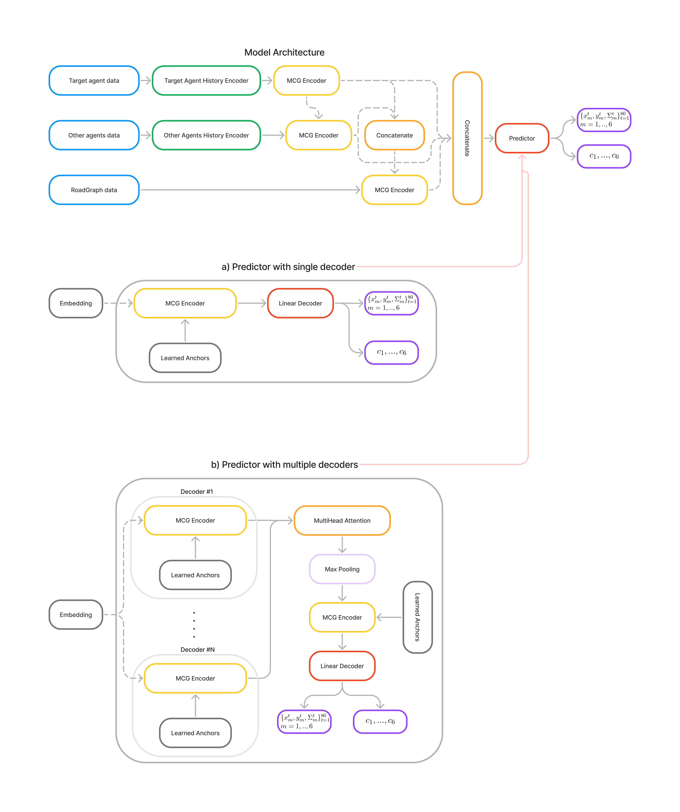

# Waymo motion prediction challenge 2022: 3rd place solution
## Our implementation of [MultiPath++](https://arxiv.org/abs/2111.14973)




## General Info:
- 📜[**Technical report**](docs/WMPC_Report_2022.pdf)   
- 🥉[Waymo Motion Prediction Challenge Website](https://waymo.com/open/challenges/2022/motion-prediction/)

## Team behind this solution:
Stepan Konev 
- [[LinkedIn]](https://www.linkedin.com/in/stepan-konev/)
- [[Twitter]](https://twitter.com/konevsteven)
- [[Facebook]](https://www.facebook.com/stepan.konev.31)

## Code Usage:
First we need to prepare data for training. The prerender script will convert the original data format into set of ```.npz``` files each containing the data for a single target agent. From ```code``` folder run
```
python3 prerender/prerender.py \
    --data-path /path/to/original/data \
    --output-path /output/path/to/prerendered/data \
    --n-jobs 24 \
    --n-shards 1 \
    --shard-id 0 \
    --config configs/prerender.yaml
```
Rendering is a memory consuming procedure so you may want to use ```n-shards > 1``` and running the script a few times using consecutive ```shard-id``` values

Once we have our data prepared we can run the training.
```
python3 train.py configs/final_RoP_Cov_Single.yaml
```

If you find this work interesting please ⭐️star and share this repo.